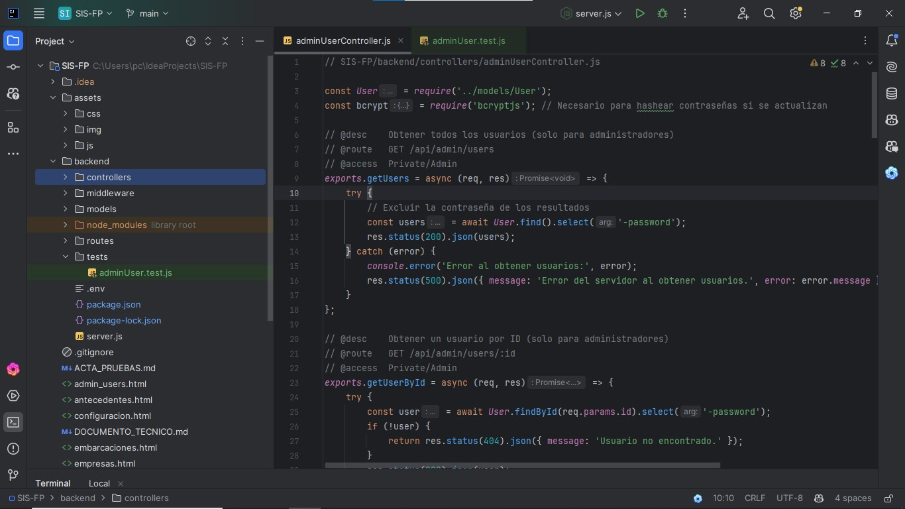
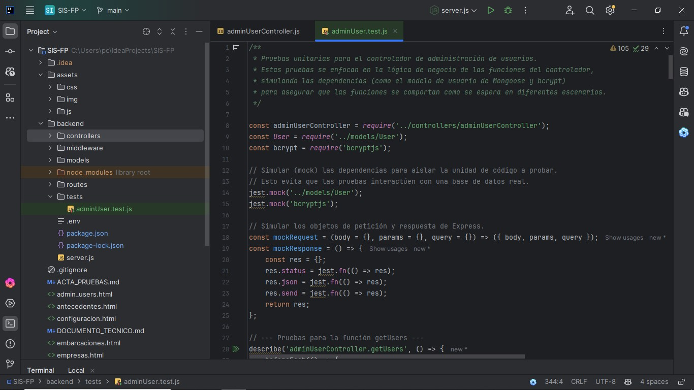
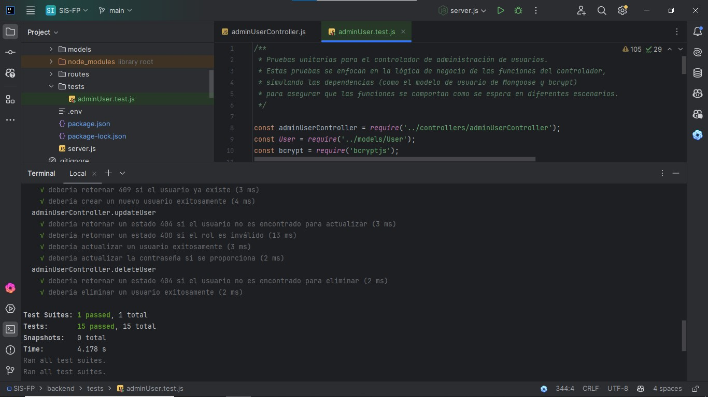

# 🚀 Taller de Pruebas de Software - SIS-FP

## 📝 Descripción del Proyecto

Este repositorio contiene la **Landing Page** desarrollada como parte del **taller de pruebas de software**, enfocado en el análisis y la demostración de la calidad del sistema **SIS-FP (Sistema de Gestión Portuaria y Seguridad)**.

El objetivo principal de esta página es documentar el proceso del taller, desde la teoría de las pruebas hasta una demostración práctica con la herramienta **Apache JMeter**.

---

## ✨ Características Principales

- **Página de Portada:** Información del aprendiz y una introducción al taller.  
- **Fundamentos de Pruebas:** Resumen de los principales tipos de pruebas de software (Funcionales, de Rendimiento, Usabilidad y Seguridad).  
- **Análisis para SIS-FP:** Recomendaciones de pruebas específicas para el sistema, enfocadas en la seguridad y el rendimiento.  
- **Demostración con JMeter:** Resumen detallado de una prueba de inicio de sesión realizada con JMeter, validando el correcto funcionamiento del *endpoint* de autenticación.  

---

## 🛠️ Tecnologías Utilizadas

- **HTML5:** Para la estructura de la página.  
- **CSS3:** Para el diseño y estilo visual.  
- **Jest:** Para las pruebas unitarias del backend.  
- **JMeter:** Herramienta de código abierto para pruebas de carga y rendimiento.  

---

## 📈 Demostraciones de Pruebas

### 🔹 1. Pruebas Unitarias (Jest)

Para garantizar la fiabilidad del código a nivel de componente, se implementaron **pruebas unitarias** en el backend. Estas pruebas se enfocaron en la lógica de negocio del controlador de administración de usuarios (`adminUserController.js`), asegurando que cada función se comporte como se espera en diferentes escenarios.

- **Metodología:** Se utilizó **Jest** para simular las respuestas de la base de datos y probar la lógica de las funciones, tanto en escenarios de éxito (creación de usuario) como de error (usuario ya existente).  

Para ejecutar las pruebas, navega al directorio `backend/` y ejecuta el siguiente comando:

**npx jest**

- **Resultado:** Todas las pruebas unitarias pasaron exitosamente, confirmando que la lógica de negocio es robusta y confiable.  

### 🔹 2. Pruebas de Carga (JMeter)
Se realizó una prueba de carga con 6 usuarios virtuales simulando inicios de sesión simultáneos en el endpoint de login del backend de SIS-FP.

**Resumen de la prueba:**

- **Tipo de prueba:** Pruebas de Carga (Validación de concurrencia en el login).

- **Herramienta:** Apache JMeter.

- **Resultado:** La prueba fue exitosa, obteniendo un código de respuesta 200 (OK) en todas las solicitudes. Esto confirma que el servicio de autenticación soporta la concurrencia de usuarios de manera eficiente.

**👨‍🎓 Información del Aprendiz**

- **Nombre:** Jhon Jairo Mejia Avila
- **Curso/Ficha:** Aprendiz en Desarrollo y Análisis de Software - Ficha 2885525

- **Institución:** SENA

- **Enlace de la Landing Page:** 👉 jjmejiaavila.github.io/taller-pruebas-sena

📌 Este proyecto es parte del proceso formativo en el área de pruebas de software, integrando teoría y práctica con herramientas modernas de aseguramiento de la calidad.